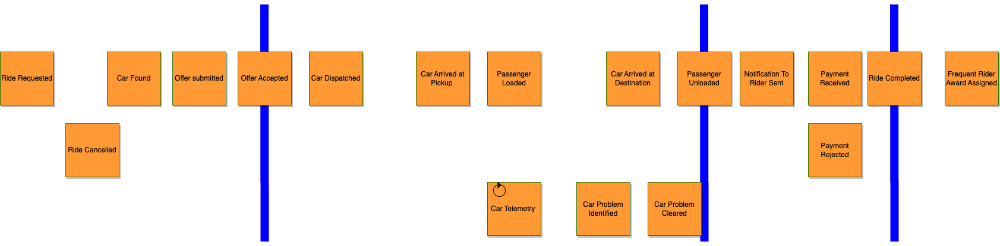
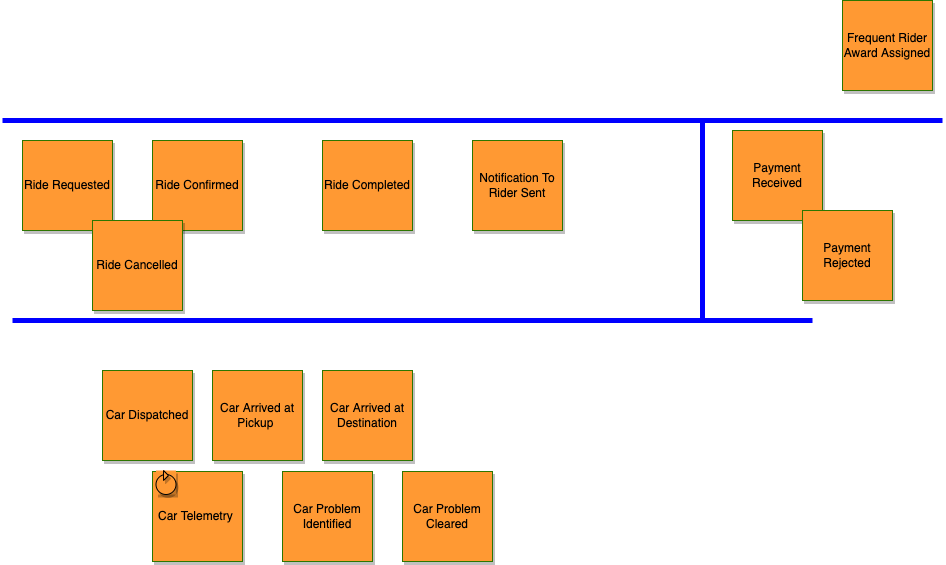
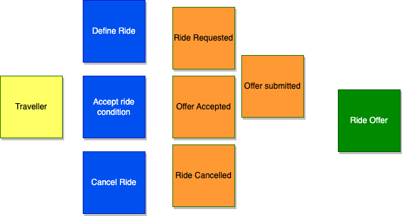
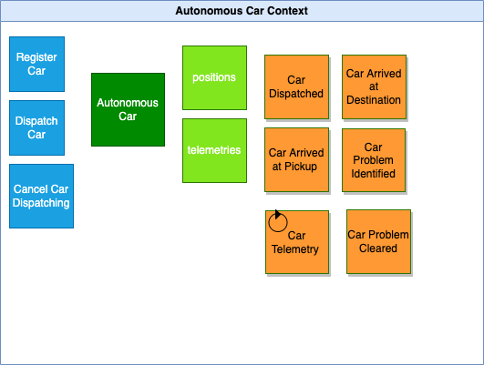
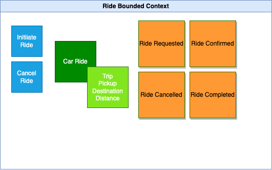
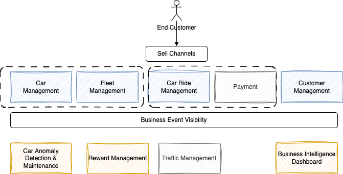

# Domain-driven design applied

To design a event-driven solution the best approach is to start by using [event storming](https://jbcodeforce.github.io/eda-studies/event-storming/) methodology as created by [Alberto Brandolini](https://en.wikipedia.org/wiki/Alberto_Brandolini).

## Event Storming

[Conducting the event storming workshop](https://jbcodeforce.github.io/eda-studies/event-storming/#conducting-the-event-and-insight-storming-workshop) involves business subject matter expert, we are mocking it in this section, to first, discover the events. 

* The discovered Events address the happy path of the process of booking a car ride on a robot taxi: 

    { width=1000 }

* Event Reorganized by concerns: Rides, Autonomous Car, Payment, Award

    { width=1000 }

### Domain-Driven Design Elements

* Aggregates: represent the main business entity within the domain and sub-domain

    { width=800 }

* Domain/Sub-domains

    { width=800 }

* Commands

    { width=800 }

    { width=800 }

* **Bounded Contexts:**

    * Autonomous Car bounded context:

    { width=800 }

    * Car Ride bounded context:

    { width=800 }

    * Customer and payment bounded contexts are not represented as we will mock them up.

* Business service map

    
