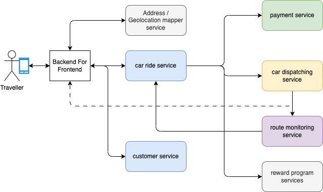

# Domain-driven design applied

To design a event-driven solution the best approach is to start by using [event storming](https://jbcodeforce.github.io/eda-studies/event-storming/) methodology as created by [Alberto Brandolini](https://en.wikipedia.org/wiki/Alberto_Brandolini).

## Event Storming

[Conducting the event storming workshop](https://jbcodeforce.github.io/eda-studies/event-storming/#conducting-the-event-and-insight-storming-workshop) involves business subject matter expert, we are mocking it in this section, to first, discover the events. 

* The discovered Events in the following figure address the happy path of the process of booking a car ride on a robot taxi: 

    { width=1000 }

    The Car telemetry events, car problem events and car problem cleared events, are not in the happy path. 

* Event Reorganized by concerns: Rides, Autonomous Car, Payment, Award

    { width=1000 }

### Domain-Driven Design Elements

* Aggregates: represent the main business entity within the domain and sub-domain

    { width=800 }

* Domain/Sub-domains

    { width=800 }

* Commands

    { width=800 }

    { width=800 }

* **Bounded Contexts:**

    * Autonomous Car bounded context:

    { width=800 }

    * Car Ride bounded context:

    { width=800 }

    * Customer and payment bounded contexts are not represented as we will mock them up.

* Business service map

    

## Component description

From the Domain-driven design bounded contexts, we may derive a set of microservices as illustrated in the following figure:

{ width=800 }

This architecture is interesting, it embraces microservices architecture, mostly synchronous HTTP based traffic. 

* The **traveler** user is using a mobile app, connected to the classical **Backend For Frontend** service, which exposes RESTful API, with may be also a websocket connection to push notifications back to the mobile app to support traffic from backend to user.
* The major component is the **Car Ride manager** service which exposes API for the user to initiate a ride to go from a geolocation A to geolocation B, and may be an API for historical rides query.
* The **address finder**, geolocation mapper, is an utility service to map address to geo-location and any other metadata to facilitate the search for the optimal itinerary and nearest available car. It is a very important service, and may be complex to implement. It exposes HTTP APIs and must respond in sub millisecond.
* The **Car Ride** service needs to integrate with other services, like the **Payment** service once the ride is terminated, and the **Car dispatcher** to get an autonomous car.
* A **car dispatcher** needs to find the closest car to support the pickup within the shortest time. The computation may take sometime, but the response to the end user will be something like: "your car will arrive in 3 minutes and the target arrival time will be 15 minutes, do you want to proceed?". Once commited the car will move to pickup address and sends car telemetries. 
* The metrics are processed by the **route monitoring** service, which computes ETA, and other interesting real-time, time-windowing logic.
* When the travel is completed, the **payment** service needs to trigger the payment and the reward program service may update the number of travel, and may be also rate the consumer. As there is no driver, there is no more driver rating. 