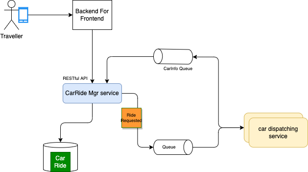

# A demonstration for an event-driven solution of autonomous car ride

???+ info "Updated"
    Created 07/06/2023 - Updated 12/05/23

This article illustrates how to apply domain-driven design, and event storming to implement an event-driven solution using different EDA patterns like Event Sourcing, CQRS, and SAGA. The solution is built incrementally adding more complexity over time, so the reader can understand how to apply DDD and all those patterns. There is not a unique solution to implement the requirements, and this repository document different view.

It will be a long journey to implement the different patterns and flavor of the solution. 

As a target implementation, we will use Java, and Python most of the time. The deployment is targeted to use local docker images, and AWS services for cloud deployment. Infrastructure as code is used to deploy dependent services and applications. Some components of the solution will also be AWS Lambda function. The demonstration includes generating CarRides data, that can be used downstream in a Data lake with Analytics.

This repository is linked to [the EDA book](https://jbcodeforce.github.io/eda-studies/) which documents the event-driven design pattern and architecture discussions.

## Application Context

The customer wants to go from one address or geographic location to another one, within a big city, using the Acme Autonomous Car Ride mobile app. The cars are autonomous cars (robot car) with no pilot. 

The application context looks like in the following diagram:

{ width=800 }

Travelers use mobile application to book a ride between two locations within the same city, the Car Ride Solution dispatches an autonomous vehicle, uses traffic report to compute ETA and pricing. The application is also monitoring existing rides via car telemetries. The Marketing analysis is an example of external system interested by the generated data. 

## Requirements

* User will use a simple user interface to demonstrate booking a car ride and then accept the payment.
* The first components will be the CarRide management and the car fleet / inventory management.
* The CarRide management will demonstrate Command Query Responsibility Segregation combined with Event Sourcing.
* Demonstrate and document the technology choices and fit for purpose.

See [event storming and DDD section for business requirements analysis](./ddd.md).

### Event Sourcing

[Event sourcing](https://jbcodeforce.github.io/eda-studies/patterns/event-sourcing/) is a design pattern adopted in Event-driven solution. It is not mandatory but it delivers some interesting advantages for such implementation, in particular to explain what happened to the business entity. The CarRide is using the event sourcing pattern, so a dedicated event stores is used to keep the change to the CarRide Entity, as illustrated in the following figure:

As the first version is supporting Query by Id operation on the CarRide, there is a CarRide table persisted in a SQL based database.

### Command Query Responsibility Segregation

[Command Query Responsibility Segregation](https://jbcodeforce.github.io/eda-studies/patterns/cqrs/index.md) is used in a lot of distributed solutions, to be able to scale the read model from the write model. The CarRide service is in fact splitted into Command and Query parts as illustrated in the diagram below:

Some AWS service, like Amazon DynamoDB by design, is using CQRS with the read replicas feature. 

### Saga pattern

The [Saga pattern](https://jbcodeforce.github.io/eda-studies/patterns/saga/index.md) is used to support distributed long running transaction with compensation mechanism in term of business transaction failure. It is a complex pattern, and the most classical implementation of the Saga is to use an orchestrator to manage the state of the Saga and being able to rollback the transaction with compensation APIs. The second solution is using events to do a Saga choreography.

## Adopting an event-driven approach to the implementation

The fact that we discovered events during the DDD phase does not mean we adopt EDA. Other non functional requirements need to be considered, like scalability, contract decoupling, reactive system needs, streaming, complex event processing logic... As introduced in the [SOA to EDA chapter](https://jbcodeforce.github.io/eda-studies/eda/#from-soa-to-eda), a business process model can be used to understand the flow of commands / data and events. 

Let revisit the business process flow in more detail using the commands, aggregates and events we discovered during [the DDD](./ddd.md). The BPMN flow illustrates swim lanes for the customer, the car ride manager, the car manager and even the car itself as generators of telemetries:

{ width=1000 }

Commands are visible as APIs for each task in the flow: CarRideManager swimlane will have at least one service responsible to manage the CarRide, and the activities in the process flow will be exposed as APIs (`createCarRide`, `updateCarRide`). 

Now by looking at this same swim lane, we may want to clearly separate the computation of next available car, and the estimated  time of arrival to a service which manages car information: a CarManager service. The same notifying a customer command, may be in a CustomerManager service. 

So swim lane to service mapping may be a wrong way to think about decomposition into service. This is why bounded context is a better approach to discover microservices.

Now the communication between those services could be synchronous, HTTP based, and using RESTful architecture... or asynchronous using one or more messaging systems. Between the mobile and the API to create a CarRideOrder, we could design it, with RESTful API, stateless. Now once the CarRideOrder is persisted, the logic to find an autonomous car could be make asynchronously with event propagation. A sub-decomposition by applying clear separation of concern could lead to the following components:

* The **CarRideManagerService** uses a Database to persist the CarRide business entity, and generates an event CarRideCreated

* The event can be sent to a queue for exactly once processing, and ordered as we do not want to see an `CarRideUpdated` event before a `CarRideCreated` event for the same `CarRideEntity`. 
* The search for an autonomous car and the computation of the ETA and pricing could be done in the `CarDispatching` service. The command is not exposed as an API but triggered by the consumption of the `CarRidCreated` Event. This is a EDA approach with choreography. The following figure illustrates the possible end to end components with the different services: 

{ width=800}